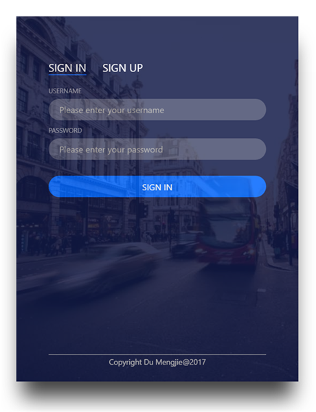

# Day001-Login

**设计图**



**知识点**

+ 圆角按钮`border-radius`
+ 阴影`box-shadow: h-shadow v-shadow blur spread color inset;`
+ 背景透明`background-color: rgba(red, green, blue, alpha);`
+ tab选项卡
+ HTML5表单
+ box-sizing
+ CSS3选择器

## 小讲堂

### hr颜色

```css
hr {
  color: #fff; /*注意，这样是不行的*/
}

hr {  /*这样才可以*/
  height: 1px;
  border: none;
  background-color: #fff;
}
```

### CSS3选项卡

利用CSS3的新增选择器实现TAB选项卡

```html
<!--结构-->
<ul class="tabs">
  <li>
    <input type="radio" name="tabs" id="tab1" checked />
    <label for="tab1">选项卡 1</label>
    <div id="tab-content1" class="tab-content">
      <p>选项卡内容 1</p>
    </div>
  </li>

  <li>
    <input type="radio" name="tabs" id="tab2" />
    <label for="tab2">选项卡 2</label>
    <div id="tab-content2" class="tab-content">
      <p>选项卡内容 2</p>
    </div>
  </li>
</ul>
```

```css
.tabs input[type="radio"] { /*隐藏radio按钮*/
  position: absolute;
  top: -9999px;
  left: -9999px;
}
.tabs .tab-content {
  z-index: 2;
  display: none; /*默认隐藏*/
  overflow: hidden;
  position: absolute;
  top: 53px;
  left: 0;
}
.tabs [id^="tab"]:checked + label {
  background: #612e76;
}
.tabs [id^="tab"]:checked ~ [id^="tab-content"] {
  display: block;
}
```

为默认选项添加checked属性，便可默认显示。

## 参考文章

纯CSS3制作的Tab选项卡：http://www.shejidaren.com/css3-tabs.html

CSS选择器参考手册：http://www.w3school.com.cn/cssref/css_selectors.asp

HTML5表单：http://www.w3school.com.cn/html5/html_5_form_input_types.asp

css3 box-sizing属性：http://www.cnblogs.com/zhaoran/archive/2013/05/24/3097482.html