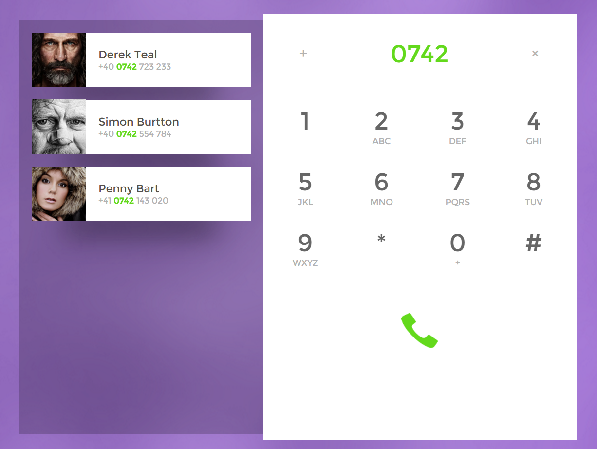

# Day003-Dial-Pad

**设计图**



**知识点**

+ flex布局
+ `text-transform`属性
+ 水平居中、垂直居中
+ 网页字体大小、单位
+ CSS3动画
+ after伪类特效

## 小讲堂

### text-transform属性

| 值          | 描述                              |
| :--------- | ------------------------------- |
| none       | 默认。定义带有小写字母和大写字母的标准的文本。         |
| capitalize | 文本中的每个单词以大写字母开头。                |
| uppercase  | 定义仅有大写字母。                       |
| lowercase  | 定义无大写字母，仅有小写字母。                 |
| inherit    | 规定应该从父元素继承 text-transform 属性的值。 |

### 水平居中

1. 行内元素——`text-align: center;`
2. 块级元素——`margin: 0 auto;`
3. 多个块级元素——如果页面里有多个块状元素需要水平排列居中，可以将元素的display属性设置为inline-block，并且把父元素的text-align属性设置为center即可实现

### 垂直居中

1. 单行的行内元素——设置height等于line-height即可

   ```css
   div { 
    height:25px; 
    line-height:25px; 
    overflow:hidden; 
   } 
   ```

2. 多行的行内元素——组合使用display:table-cell和vertical-align:middle属性来定义需要居中的元素的父容器元素

   ```css
   .container {
     background: #222;
     width: 300px;
     height: 300px;
     /* 以下属性垂直居中 */
     display: table-cell;
     vertical-align:middle;
   }
   ```

3. 块级元素——使用transform属性来垂直移动来实现垂直居中

   ```css
   .item {
     top: 50%;
     position: absolute;
     transform: translateY(-50%); /* 这里我们使用css3的transform来达到类似效果 */
   }
   ```

4. 一个hack方案

   ```css
   .container {
     width:200px;
     height: 200px;
     /* 以下属性垂直居中 */
     position: absolute;
     top: 0;
     bottom: 0;
     left: 0;
     right: 0;
     margin: auto;
   }
   ```

### 水平垂直居中

一般的行内/块级元素通过以上方法的简单组合即可实现水平垂直居中，下面介绍两个**简单粗暴**的方法：

1. transform

   ```css
   .item {
     position: absolute;
     top: 50%;
     left: 50%;
     transform: translate(-50%, -50%);
   }
   ```

2. flex布局

   ```css
   .parent{
     display: flex;
     justify-content:center; /*水平居中*/
     align-items: center; /*垂直居中*/
     
     /* 注意这里需要设置高度来查看垂直居中效果 */
     background: #AAA;
     height: 300px;
   }
   ```

## 参考文章

网页元素CSS居中实现完整攻略：http://www.gbtags.com/gb/gbliblist/20.htm

CSS text-transform 属性：http://www.w3school.com.cn/cssref/pr_text_text-transform.asp

CSS尺寸和字体单位-em、px还是%：http://www.cnblogs.com/whitewolf/p/css-em-px-percentage.html
