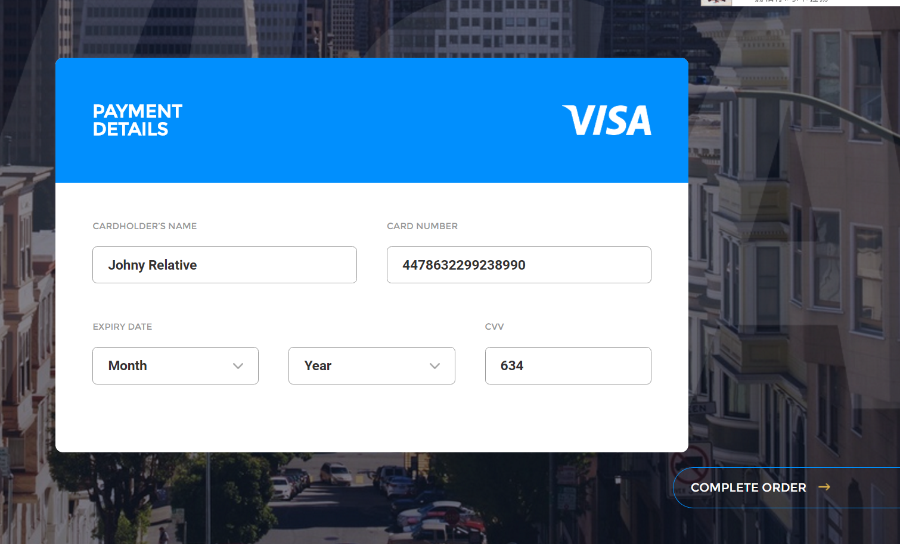

# Day004-Credit-Card-Payment

**设计图**



**知识点**

+ flex布局
+ `appearance`属性
+ SVG

## 小讲堂

### appearance属性

appearance 属性允许您使元素看上去像标准的用户界面元素

| 值      | 描述               |
| :----- | ---------------- |
| normal | 将元素呈现为常规元素。      |
| icon   | 将元素呈现为图标（小图片）。   |
| window | 将元素呈现为视口。        |
| button | 将元素呈现为按钮。        |
| menu   | 见元素呈现为一套供用户选择的项。 |
| field  | 将元素呈现为输入字段。      |

### SVG

SVG 是使用 XML 来描述二维图形和绘图程序的语言。

- SVG 指可伸缩矢量图形 (Scalable Vector Graphics)
- SVG 用来定义用于网络的基于矢量的图形
- SVG 使用 XML 格式定义图形
- SVG 图像在放大或改变尺寸的情况下其图形质量不会有所损失
- SVG 是万维网联盟的标准
- SVG 与诸如 DOM 和 XSL 之类的 W3C 标准是一个整体

```html
<html>
<body>

<svg xmlns="http://www.w3.org/2000/svg" version="1.1">
  <!--画一个边框为黑色，填充为红色的半径为40的圆-->
  <circle cx="100" cy="50" r="40" stroke="black"
  stroke-width="2" fill="red"/>
</svg>

</body>
</html>
```

**SVG形状**

SVG 有一些预定义的形状元素，可被开发者使用和操作：

- 矩形 <rect>
- 圆形 <circle>
- 椭圆 <ellipse>
- 线 <line>
- 折线 <polyline>
- 多边形 <polygon>
- 路径 <path>

## 参考文章

CSS3 appearance大全鉴赏以及是否影响box-sizing：http://www.zhangxinxu.com/wordpress/2016/07/css3-appearance-all-box-sizing/

CSS3 appearance 属性：http://www.w3school.com.cn/cssref/pr_appearance.asp

SVG教程：http://www.w3school.com.cn/svg/index.asp

纯CSS实现帅气的SVG路径描边动画效果：http://www.zhangxinxu.com/wordpress/2014/04/animateion-line-drawing-svg-path-%E5%8A%A8%E7%94%BB-%E8%B7%AF%E5%BE%84/